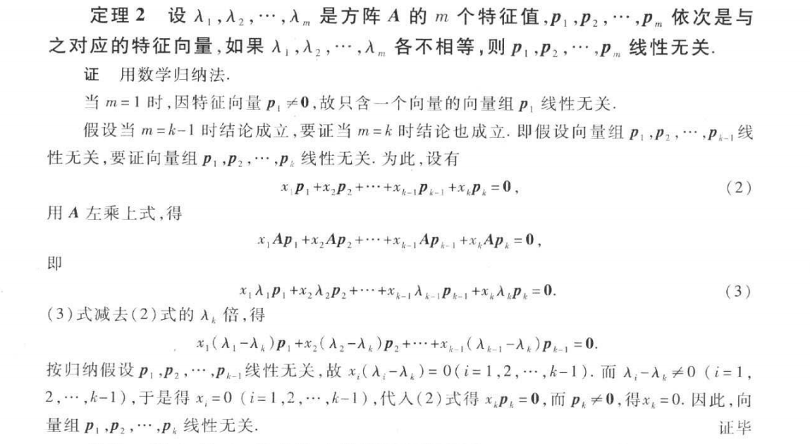
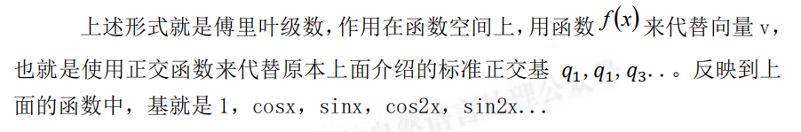
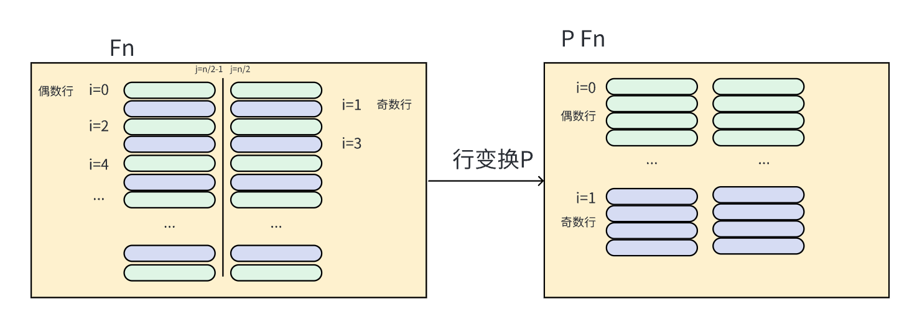

# 线性代数MIT笔记

[TOC]

### 1、方程组的几何解释

##### 线性方程组可以看作行图像/列图像

e.g.
$$
\begin{equation}
\left\{
	\begin{array}{lr}
		2x-y=0 & \\
		-x+2y=3 &
	\end{array}
\right.
\end{equation}
$$
​	行图像：

​    列图像：

##### 矩阵乘法的两种理解方式

​    p.s. 矩阵间乘法的结果最初是定义出来的
$$
C_{ij}=\sum{A_{ik}*B_{kj}} (k=1,2,...)
$$
  但结果可以看作经过行/列向量组合得到的

列向量的组合(推荐): 对A的列向量进行组合

行向量的组合:

### 2、矩阵消元

#### 极速矩阵计算:!!!! 整行/整列进行矩阵计算

**在左乘X：行生成行，对行进行分配**

**在右乘X：列生成列，对列进行分配**

（上述性质通过直观感知即可明白，类似提公因式）

以行乘为例，针对结果的第一行的每一个，都是用1*（第一行的每一个），

第一行的每一个，都是用2*（第二行的每一个），

其余类似

#### 例题：

$$
A=\left(\begin{matrix}
 4 & -1 & 2 & 1 \\
 1 & 1 & 0 & 3 \\
 0 & 3 & 1 & 4 \\
\end{matrix}\right)
, & 
B=\left(\begin{matrix}
 1 & 2 \\
 0 & 1 \\
 3 & 0 \\
 -1 & 2 \\
\end{matrix}\right)\\
求AB=?
$$

解：使用行法/列法，此时可以口算（用行，脑中列B的算后竖式）
$$
AB=\left(\begin{matrix}
 9 & 9 \\
 -2 & 9 \\
 -1 & 11 \\
\end{matrix}\right)
$$

### 3、乘法和逆矩阵

#### 矩阵乘法方法总结

1、定义：A 的行向量乘上 B 的列向量
$$
C_{ij}=\sum{A_{ik}*B_{kj}} (k=1,2,...)
$$
2、行速算

3、列速算（见上）

4、**列乘以行  **: A 的列向量乘上 B 的行向量得到各个矩阵，再将矩阵相加

证明:

例题：

5、**分块乘法 ** : 宏观矩阵乘法

证明：[矩阵分块相乘](https://zhuanlan.zhihu.com/p/133330692)

**对3.的补充：**

- **B为单列**

在变成3.时，加入行，列的划分（此时列数为1）：更详细的证明为将其分别写作
$$
A=\left(\begin{matrix}
 A11 &  A12 \\
 A21 &  A22 \\
\end{matrix}\right)
, & 
B=\left(\begin{matrix}
 B11 &  B12 \\
 B21 &  B22 \\
\end{matrix}\right)\\
C=\left(\begin{matrix}
 C11 &  C12 \\
 C21 &  C22 \\
\end{matrix}\right)\\
$$

结合图例理解，此时B11,B12等都为单列，根据列对列的分配，即B11，B21对A11,A12的列分配得到新的列C11

即C11=A11 B11 + A12 B22，

同样地，下半部分也是这样：C21=A21 B11+ A22 B21(只不过原来是整列直接分配，现在分成两个部分分开分配，其实是一个东西)

所以B分为单列的得证。

- **进一步B为多列**

​    即把B的（1，3）和边上的（* ，*）分成一块，可以简单地知道，同样是逐列分配，（1，3）那列分配后得到第一列，（ * ，*）那列分配后得到第二列，所以还是可以写成C11=A11 B11 + A12 B22等的形式。

​    所以B分为多列的得证。

- **再进一步分成多列多行块，不止两块**

​    由于分成两块成立，对其中的块继续分也成立，所以多块成立。

**至此，分块乘法得证!**

#### 逆矩阵

- 定义：

- 判定无逆矩阵

**若存在非零向量 x，使得 Ax = 0，那么 A 就不可能有逆矩阵**(否则若有，两边同左乘A-1=>x=0矛盾)

- 逆矩阵求解：**高斯-若尔当方法**

​	证明：行变换的整个矩阵可以记作E，即整个过程左乘了一个E，即E(A I )=(I ?)

​            那么利用分块矩阵乘法，EA=I => E=A-1 =>EI = A -1 ,

​            即上述式子右边的值为A-1,得证。

- 性质：
  $$
  (AB)^{-1}=B^{-1}A^{-1}
  $$
  直接相乘即可证明。

### 4、矩阵A的LU分解

#### 转置

定义：a_ij=a_ji

性质：
$$
(AB)^{T}=B^{T}A^{T}
$$

$$
\begin{align*}
&证明:\\
&设结果为C_{ij},左边式子转置前对应C'{ji}=\sum{a_{jk}*b_{ki}} \\
&右边式子同样求对应位置C_{ij}的式子为\sum{b'{ik}*a'_{kj}}=\sum{b_{ki}*a_{jk}},\\
&所以左右两边相等，得证。
\end{align*}
$$

#### 矩阵A的LU分解

秒解逆矩阵方法：

​	例如(E32)-1, 只需要5*row2+row3即可，所以根据行分配法，

​    该逆矩阵（行分配矩阵）第三行为0 * row1 + 5*row2 + 1 * row3 =>(0,5,1)

#### 消元变化本质：

​	**A=LU(利用行变换L生成上三角矩阵U,而L 是一个主对角线全为 1 的下三角矩阵(因为消**

**元过程总是向下消元))** 

### 5、转置-转换-向量空间 R

#### 置换矩阵：

​	所谓的置换矩阵 P，就是用来完成行交换的矩阵，更具体来讲，是行重新排列

了的单位矩阵。例如 I 就是一个置换矩阵，只不过 I 对矩阵没影响。

性质：
$$
PP^T=I，即P^{-1}=P^T
$$
证明：

#### 对称阵：

A^T=A

#### 向量空间：

​	def : 该空间**对线性运算（相加，数乘）封闭**

#### 子空间: 

取向量空间的一部分，还能构成向量空间的部分我们称之为子空间

### 6、列空间和零空间

#### 列空间：列向量线性组合构成的空间

重要理解：Ax=b是否有解 <=> b是否在A的列空间中（列向量线性组合中）

#### 零空间：Ax=0的解x构成的空间

零空间始终为子空间（因为对数乘和加法封闭，始终有A(a1x+a2x')=0）

### 7、求解 Ax = 0，主变量，特解

#### 秩的定义：

**def  (同济线代第6版定义) :**

​	设在矩阵A中有一个**不等于0**的r阶子式D,且所有r+1阶子式[^1]（如果存在）全等于0，那么D称为矩阵A的最高阶非零子式，**数r称为矩阵的秩**，记作R(A),并规定零矩阵的秩为0.

​	理解：简单来看，子式（行列式）[^2]是否为0等价于是否有行线性相关（即最后某行被消去为0）=>所以，定义可以转换为

=>矩阵A转化为的 行阶梯矩阵 有r行都非0，任意r+1行一定存在一行为0

（**行阶梯矩阵** 表示 矩阵中 线性相关的行 (若有)已经被去掉为0了）

=>

**等价定义(更常用)：**

​		矩阵A转化为的 **行阶梯矩阵的非零行行数 r **即为**A的秩**。

[^1]: 子式的定义：在m*n矩阵A中，**任取**k行与k列(k<=m,k<=n),位于这些行列交叉处的k^2个元素，不改变它们在A中的所处位置次序而得到的k阶行列式，称为矩阵A的k阶子式。
[^2]: 行列式的计算：按照任意一行（列）进行展开，乘以代数余子式Mij进行求和。

这样，A的秩也可以理解为**主元的个数**（非零行)

def : 非主元所在列——**自由列**

=>性质1：列数=n-r

=>性质2：求解Ax=b时自由列可以任意取值（一定能得到唯一解）
$$
\begin{align*}
&证明:\\
&\quad 首先，r个主元<=>r个有效方程 ; n个未知数，所以自由度为n-r。\\
&e.g \\
&A=\left(\begin{matrix}
 1 & 2 & 0 & -1 \\
 0 & 0 & 1 & 2 \\
\end{matrix}\right)
, 
X=\left(\begin{matrix}
 x_1 \\
 x_2\\
 x_3\\
 x_4\\
\end{matrix}\right)
,
Ax=b=\left(\begin{matrix}
 b_1 \\
 b_2\\
\end{matrix}\right)
\\&\quad 因为所有主元列都可以把其他行该列消为0，所以所有非主元列就可以任意取值（此时为x_2,x_4),
\\&结果变为一行一个变量对应一个数的情况，所以一定有唯一解。
\\&\quad 这也验证了自由度为n-r(因为非主元列的列数刚好为n-r)
\end{align*}
$$
​	同时可以得到，A行变换后的矩阵形式类似为
$$
\left(\begin{matrix}
 I &  F \\
 0 &  0 \\
\end{matrix}\right)
$$
但I , F（Free Cols）的列可能会存在交叉，如上例,

得到的X形式上为（同样可能行有交叉)
$$
X=c\left(\begin{matrix}
 -F \\
 I \\
\end{matrix}\right)
（利用分块矩阵乘法+列分配即可得到）
$$

#### 求解Ax=0

对自由变量（列）赋值得到特殊解，线性组合即得到通解

### 8、Ax=b 的可解性和解的结构

#### **可解性**：

b是否在A的列向量线性组合的列空间中

#### **解结构**：

**通解 = 矩阵零空间通解 + 矩阵特解**

证明：

补充（由于解出了Ax=0的通解，所以v-x0一定在其中，所以相加后一定能得到Ax=b的通解。）

#### 秩与解的关系：

m*n矩阵A

- **列满秩（r=n<m)**

  无自由元 => 若方程有解，则解唯一，A消元后形式为
  $$
  A \stackrel{r}{\sim} \left(\begin{matrix}
   I\\
   0\\
  \end{matrix}\right)
  $$
  p.s : n 不可能大于m 否则列一定线性相关，不可能满秩

  

- **行满秩（r=m<n)**

​		自由元个数n-r，一定有无穷多解，A消元后形式为
$$
A \stackrel{r}{\sim} \left(\begin{matrix}
 I & F\\
\end{matrix}\right)
$$

- **满秩（r=m=n)**

  一定有唯一解

$$
A \stackrel{r}{\sim} I
$$

- **不满秩（r<m , r<n)**

  两种解可能：

  - 不满足可解条件（零行导致的可解条件）
  - 解无穷多个（特解 + 零空间所有向量）

$$
A \stackrel{r}{\sim} \left(\begin{matrix}
 I & F\\
 0 & 0\\
\end{matrix}\right)
$$

### 9、线性相关性，基，维数

#### 向量组的线性无关与线性相关:

#### 基:

- 定义：

- 性质 :

$$
\begin{align*} 
\\&𝑅^𝑛中的 n 个向量构成基，
\\&则以这 n 个向量构成的 n*n 矩阵必须可逆。
\end{align*}
$$

​		这个性质很好理解，矩阵可逆就意味着任意两行，两列都线性无关，所以可以构成一组生成空间的基。 

#### 维数：

$$
𝑅^𝑛空间的\textbf{基中向量个数}为 n 个。这个n我们称之为\textbf{维数}。
$$

#### 联系：

- **矩阵** A 的**秩** = 矩阵 A 主列的个数 = A **列空间的维数** = **r**

- **零空间维数 = n-r** （所谓零空间维数，即是零空间基的个数，也是 Ax = 0 的特解的个数，还可以理解为：Ax = 0 的解中自由变量的个数。）

### 10、四个基本子空间

#### 定义：

#### 维数与基：

**（1） 列空间：** 

​	设矩阵 A 的秩为 r，则 A 有 r 个主列，这 r 个主列就是列空间 C(A)一组基，一组基里有 r 个向量，所以**列空间维数为：r**。

​	**基求法：**行阶梯矩阵，主元列，赋值自由变量，得到基向量。

**（2） 零空间：** 

​	矩阵 A 秩为 r 时，自由列为 n-r 列。这 n-r 列决定了 x中的 n-r 个自由变元，赋值后就构成了零空间的 n-r 个基向量，故**零空间维数**

**为：n-r**。

​	**基求法:**  对自由变量（列）赋值得到特殊解，即为基向量。

**（3） 行空间：** 

​	A 的行空间可以化为𝐴^𝑇的列空间。但我们这里使用的方法是直接对A 的行向量进行变换（其实一样），最后**行空间的维数也是秩数** 

**r。** (由矩阵秩r的定义 = 行阶梯矩阵非零行行数(主元列的个数) => 线性无关行数 => 行空间维数)

​	**基求法:** 行阶梯矩阵，非零行即为基向量。

p.s. **行变换不改变行空间，但是改变列空间**

**（4） 左零空间：** 
$$
\begin{align*} 
\\& \quad 定义为:A^𝑇y = 0,y构成的空间。
\\ & \quad 我们不处理𝐴^𝑇，所以将方程两边同时转置，得到：𝑦^𝑇A = 0。我们看到，对于 A 矩阵本身来说，𝑦^𝑇左乘矩阵 A 得到零向量，所以我们称之为\textbf{左零空间}。
\\&\quad 但，还是理解为𝐴^𝑇的零空间更直接一点。
\end{align*}
$$
​	𝐴^𝑇是一个 n*m 的矩阵，m 与 n 位置颠倒，所以**𝐴^𝑇零空间（左零空间）维数为m-r**。

重要理解：

- 零空间内的向量反映的是 **A 列向量线性组合**，最终得到零向量。(Ax=0)

- 而左零空间反映的就是 **A 行向量的线性组合**，最终得到零向量。（yTA=0)

​	**基求法:** 利用 **高斯-若尔当更一般的方法** 求解基（实际上就是行变换 使向量变为0的解）。

​		**目标：yT A=0**（行组合得到零），求行组合y^T实际上是在求 ? A=0 ,那么可以参考高斯-若尔当方法进行求解（增加一个单位阵，来使用右侧的E记录整体变化的操作）。
$$
\left(\begin{matrix}
 A & I\\
\end{matrix}\right) 
\stackrel{r}{\sim} 
\left(\begin{matrix}
 R & E\\
\end{matrix}\right)
\\（ 即
E\left(\begin{matrix}
 A & I\\
\end{matrix}\right)=(R & E) ）
$$
​		利用 EA = R(行最简矩阵)求出E，寻找 R 中的零行，对应找到 E 中的线性组合方式，就得到了左零空间的基。(零行个数=m-r=基个数（自由列个数)

p.s : 求逆时使用的方法是该法的特例，R=I,E=A^-1，此时A、R都不一定是个方阵，更不要说可逆。

### 11、矩阵空间、秩 1 矩阵

#### 矩阵空间 

##### 引入：

​	线性空间的元素并不一定是实数组成的向量，我们可以将所有 3*3 的矩阵当成一个所谓“向量空间”中的向量，因为它也满足[线性空间的要求](https://zhuanlan.zhihu.com/p/597137349)。

​	这里我们可以将所有的 3*3 矩阵看做了一个线性空间，那么它的子空间有：上三角矩阵，对称矩阵，对角矩阵，

e.g. 3*3对角矩阵的一组基：（线性组合构成整个子空间）
$$
\left(\begin{matrix}
 1 & 0 & 0 \\
 0 & 0 & 0 \\
 0 & 0 & 0 \\
\end{matrix}\right)
\left(\begin{matrix}
 1 & 0 & 0 \\
 0 & 3 & 0 \\
 0 & 0 & 0 \\
\end{matrix}\right)
\left(\begin{matrix}
 0 & 0 & 0 \\
 0 & 0 & 0 \\
 0 & 0 & 7 \\
\end{matrix}\right)
$$

##### 基与维数：

​	例如，所有 3*3 矩阵构成的集合 M 可以被称为空间。

一些性质：

##### 一个小例子：

#### 其他线性空间

##### 微分方程

​	线性空间内元素不一定是向量，矩阵，还可以是方程的解。

#### 秩一空间

定义：秩为 1 的矩阵。

**优点：**

- 易于分解：

​	

- 可以搭建高维矩阵 : 比如秩为 4 的矩阵，通过四个秩一矩阵就能搭建出来。（参考矩阵的秩一分解）

### 12、图与网络

#### 图与关联矩阵

关联矩阵：每一列代表一个节点，每一行代表的就是一条边的走势 A( Edge*Node )

    
    

回路<=>线性相关 : 例如edge1,edge2,edge3构成回路，前三行线性相关。

基尔霍夫方程可以写出线性代数的形式。

### 13、复习一

具体内容见`relevant_pdf/复习1.pdf`

### 14、正交向量与子空间

**向量正交（直角）的定义1：**
$$
 \left\|x\right\|^2+\left\|y\right\|^2=\left\|x+y\right\|^2
$$
进一步展开
$$
\begin{align*}
&x^Tx+y^Ty=(x+y)^T(x+y)\\
=>&x^Tx+y^Ty=x^Tx+x^Ty+y^Tx+y^Ty\\
=>&x^Ty=0(\because x^Ty=y^Tx)
\end{align*}
$$
即**向量正交的定义2：**
$$
x^Ty=0
$$

**子空间正交的定义**：
$$
子空间S,T正交 <=> S中 \forall 向量 与T中\forall向量都正交
$$

四个基本空间的关系（行空间正交于零空间，列空间正交于左零空间，且维数互补）

**零空间与行空间的正交关系：**

证明：

​	利用子空间正交的定义，

​	已知对于一个固定的矩阵A，零空间为Ax=0的x的线性组合，行空间为A的行的线性组合

​	那么此时Ax=0的x就可以表示x的线性组合（由于Ax1=0,Ax2=0,A(kx1+jx2)=0）
$$
A=\left(\begin{matrix}
 .. & .. & .. &  \\
 .. & .. & .. &  \\
 .. & .. & .. &  \\
\end{matrix}\right),
x=\left(\begin{matrix}
 x_1\\
 x_2\\
 ..\\
 x_n\\
\end{matrix}\right)，Ax=0
$$
​	而A的任意一行乘以x都为0，所以A的行向量的线性组合乘以x也为0，所以两个子空间正交（通过两个空间任意向量正交证明）

**同理，左零空间与列空间正交（A^Ty=0）**

### 15、子空间投影

#### 二维平面上的投影

​	完整推导：
$$
\begin{align*}
注意，此时x为标量，a^Ta也为标量!\\
&a^T(b-xa)=0\\
=>&a^Tb=xa^Ta\\
=>&x=\frac{a^Tb}{a^Ta}\\
代回p=xa,得\\
&p=a\frac{a^Tb}{a^Ta}
\end{align*}
$$

##### 二维投影矩阵

p = **P**b（**P是投影矩阵**，作用于 b 向量上）

由上述式子可以得到，
$$
\begin{align*}
&\textbf{P}=\frac{aa^T}{a^Ta}
\end{align*}
$$
**二维投影矩阵性质**：

- P^T=P(利用公式推导，只有上半部分是矩阵，需要转置)

- P^2=P(直接做乘法证明，其得到的结果具有明显的几何意义:在某个方向上重复投影=单次投影)

  

#### 高维（一般）平面上的投影

##### 对于任意矩阵A，有r(A^T A)=r(A)

**证明：**

- **首先，证明A^TA的零空间与A的零空间相同。**

  正向：

  ​	x在ATA的零空间里，所以ATAx＝0。

  ​	我们在等式两边同左乘xT，可以得到（Ax）TAx＝0

  ​	也就是‖Ax‖²＝0，所以Ax＝0（因为x^Tx=0,每个数的平方和，所以每个都是0），所以x也在A的零空间里。 

  反向：

  ​	让A是任意的一个矩阵，x在它的零空间里，即，Ax＝0。

  ​	在等式两边的左侧同乘AT，可以得到ATAx＝0，所以，x在矩阵ATA的零空间里。

  得证。

- **接着，证明r(A^T A)=r(A)**

  ​	因为A^TA与A有相同的零空间，即两者线性组合得到零的方式是相同的，即列的相关关系是相同的；既然列间相关关系是相同的，所以线性相关的个数也是相同的，即秩相同。

  ​	得证。

**A^T A的性质**：方阵，对称，（不一定可逆,仅当A的各列线性无关时，才满秩，即可逆）

##### 高维（一般）投影矩阵

显然，更高维只是ai的个数变多，整体式子不变，即该式具有一般性。

即
$$
\begin{align*}
&\textbf{P}=A(A^TA)^{-1}A^T
\end{align*}
$$

**高维（一般）投影矩阵性质**：P^T=P ； P^2=P（对式子进行转置或乘法即可得到结果）

​	当A可逆时/A列向量无关时，A^TA可逆（满秩），P可以化简为 I(单位阵)——同时，可以用另一个角度理解：当A可逆，其列空间为n维空间，所以投影矩阵不需要，即任意向量都在其中，即用单位阵 I 即可。

#### 为什么需要投影?

​	Ax=b可能无解，因为掺杂了一些坏数据，此时要求出Ax=b的近似最优解

=>解最近的（微调b,将b投影到最近的A的列空间中）

=>Ax=b转化为A𝑥̂=p

具体求法见下一部分。

重要理解：**两边同乘一个矩阵可能会改变等式两边关系**

- **同乘可逆矩阵等式关系不变**（因为可以同乘其逆矩阵返回/没有损失限制信息）

- **同乘不可逆矩阵等式关系会变**（乘以一个奇异矩阵可能会使原本不相等的关系变得相等。这是因为奇异矩阵可能会使某些行或列变为零，从而丢失原来的限制信息。）

  ​	例：

  

### 16、最小二乘法

#### 引入：

无解方程的最优解=>将b投影到最近的A的列空间中

    
    

#### 求解方法:

**推导：**

将b投影至最近的A列空间（列满秩），
$$
\begin{align*}
&\textbf{P}=A(A^TA)^{-1}A^T
\end{align*}
$$

**最终公式：**

（两边同乘A^T(由于A不一定可逆，所以解可能与原来的不同，记作𝑥̂) ,主要是原来Ax!=b，所以同乘后也不等。）
$$
𝐴^𝑇A𝑥̂ = 𝐴^𝑇b：
$$

### 17、正交矩阵和 Gram-Schmidt 正交化

#### 标准正交矩阵

标准正交矩阵 Q

当Q为方阵时，有Q^ T=Q ^(-1)

#### Gram-Schmidt(格拉姆——施密特) 正交化

##### 目的：将线性无关向量组=>标准正交向量组

##### 方法：

两个向量时：就是将一个向量投影到另一个向量上，可以直观看出（减去的量就是简单的投影公式，两个向量作点积，然后除以一个向量的模长平方（是平方的原因是有一个用来将A归一化））

多个向量时：简单来说就是将原来该向量在前面若干个已经形成的基向量上的分量减去，就得到新的一个基向量

##### 矩阵形式表示: A=QR

其中A为初始的列向量无关向量组，而Q为最终得到的标准正交向量组，R为列变换矩阵（就是用于减去新量在各个原有基上的分量）

同时，可以证明R同时为上三角矩阵。（可以很直观得到，因为每一个新的(下一个)基向量都是由Rii与前面基向量的线性组合得到的，而右乘就是列分配，所以可以得出R同时为上三角矩阵）

​	e.g. 第三个基=R13*第一列（已为基）+ R23 * 第二列（已为基） + R33 *第三列(原有非基量)

R的大体形式如下：(其中Rij等可以为0)
$$
R=\left(\begin{matrix}
 R_{11} & R_{12} & R_{13} & .. \\
 0 & R_{22} & R_{23} & .. \\
 0 & 0 & R_{33} & .. \\
 0 & 0 & 0 & .. \\
 .. & .. & .. & .. \\
\end{matrix}\right)
$$

### 18-19、行列式介绍

#### 引入与定义

​	行列式最早是在解决线性方程组问题中被引入的。在解决线性方程组时，人们注意到，对于一组线性方程，当系数矩阵的某种“度量”为零时，这组方程没有唯一解。

​	这种“度量”就是行列式。如果一个线性方程组的系数矩阵的行列式不为零，那么这个线性方程组就有唯一解；如果行列式为零，那么这个线性方程组就可能没有解或者有无穷多解。

**矩阵A的行列式记作 det(A) 或 |A|**

来源：`线性代数 讲义同济大学数学科学学院 李忠华`

​                             

行列式的定义是基于其展开和置换的概念的。对于 n×n 的矩阵，我们可以计算其行列式通过所有可能的 n!个置换的组合。每一个置换都是通过从每一行选择一个元素，并且每一列只被选择一次，然后将这些元素乘起来，乘以一个系数，这个系数取决于这个置换是奇置换还是偶置换。

#### 由定义推出的性质：

所有性质对列也成立，因为行列式的定义与行/列无相关，所以从行/列解释性质完全等价。

- **性质一：对于单位阵 I，有：**|𝐈| **= 1**   （当我们尝试通过所有可能的置换来计算单位阵的行列式时，我们会发现只有一个置换能得到非零的结果，那就是恒等置换（即每一行的元素都选择其对角线上的元素）。这个置换的结果是所有对角线元素的乘积，即 1，并且这是一个偶置换，所以它的系数为 +1。）

- **性质二：交换两行后，行列式的值相反** 

  - 逆序数：

    

  - 证明：假设交换的是第i行与第j行

    由行列式的定义，结果是乘积的和，对于其中任意一个乘积，有

    

    ​	即对于任意一组乘积，乘积数不变时，其逆序数组由（a1,a2,...,ai-1,ai,...,aj,aj+1,...）变为（a1,a2,...,ai-1,aj,...,ai,aj+1,...）(交换ai,aj),

    ​	由于其他相对位置不变，所以等价于只需要考虑（ai,...,aj）交换ai，aj后【<ai，ai+1~aj-1>, <ai+1~aj-1,aj>,<ai,aj>】三个逆序数对总和的奇偶性变化。

    ​	那么考虑ai+1~aj-1中任意一个ak,可以发现无论ak的大小位于ai,aj之间，或大于ai,aj，或小于ai,aj,交换后<ai,ak>+<ak,aJ>的奇偶性不变，

    ​	所以交换前后，<ai，ai+1~aj-1> + <ai+1~aj-1,aj>的奇偶性不变，

    ​	而又因为交换ai,aj一定会使<ai,aj>的逆序数奇偶性发送变化，

    ​	所以，交换i,j两行会使任意一组乘积的值不变，但逆序数和奇偶性变化，即该组乘积变为其相反数。

    ​	而又因为是任意一组乘积都为变化相反数，所以行列式（所有乘积的和）也变为其相反数，得证。

- **性质三：**

  - **按行提出矩阵中的系数**：
  - **单行可加性:**
  - 对列同理

​	（可以通过行列式定义，每一个加和项都被扩大了t倍，所以整个结果被放大t倍；可加性可以通过乘法分配律得到）

- **性质四：如果两行相等，那么行列式等于 0**（利用性质二，交换该两行，但值等于其本身又等于相反数，所以值为0）

- **性质五：**

  - **从矩阵的行 k 减去行 L 的 i 倍，对应的行列式值不发生改变**（利用性质三，拆分出减去行L的i倍的矩阵，由于该矩阵第k行与第L行相等，由性质四，知该矩阵行列式为0，所以减去0，行列式值不变）
  - 列同理（通过分解可知）

- **性质六：**

  - **如果有一行为零，那么 A 的行列式为 0**（利用定义展开即得）
  - **如果有一列为零，那么 A 的行列式为 0**（每一项都会有那一列，所以总体为0）

- **性质七：上三角矩阵对应的行列式的值等于其对角线上元素的乘积** （每一行可选唯一）

- **性质八：** |𝑨|**不为零，当且仅当 A 可逆**（不可逆矩阵消元能得到全零行，其行列式必为 0。而可逆矩阵消元后各列都有主元，行列式就是主元的乘积，其行列式不为 0。）

- **性质九：方阵乘积的行列式 = 方阵行列式的乘积，即：**|𝑨𝑩| **=** |𝐀||𝐁| 

  - 证明：将AB的结果换一种表示形式，让其显示地表示出来（然后对其列变换，即可证明）

    - 前置定理4.10：

    - 前置定理证明：

      

      

- **性质十：** |𝑨^𝑻| **=** |𝐀|

  - 证明：

    

#### 代数余子式：

- **引入原因**：另一种表示行列式的方法

- **定义**：

- **引出行列式的另一种计算方法：**

​	可以通过直观感知，任意一个数与其相乘的就是剩余非本行非本列的其他内容，即余子式，而考虑到逆序数，就变为代数余子式。

​	**详细证明**如下：

​									

- **一些其他性质**：

  

  

### 20、行列式的应用：克莱姆法则、逆矩阵、体积

#### 逆矩阵另一计算公式：

#### 克莱姆(Cramer)法则：

另一种求解线性方程组Ax=b的方式。（形式好看但不实用）

证明：

#### 行列式的几何意义：体积

目前证明二维和三维的情况，更高维的期待后续有新的直观方法证明，目前还不太会orz.

### 21、特征值、特征向量(Eigenvalues and Eigenvectors)

#### 引入：

**Ax即一个类函数作用在x上**。现在考虑A作用在什么的**非零x**上使得x仍在原来的方向上，即Ax=λx(A先确定)

#### 正式定义：

**Ax=λx=λEx <=> (A-λE)x=0**

满足Ax=λx的**数λ**称为**矩阵A的特征值**，**非零向量x**称为**A对应于特征值λ的特征向量**。

p.s ：奇异矩阵：方阵且行列式为0（非满秩）

#### 性质：

 (A-λE)x=0

**有解充要条件：**方程要有非零解，等价于 A-λE的线性组合包含零空间，即A-λE非满秩/**det(A-λE)=0**

将det(A-λE)=0具体展开
$$
\begin{align*}
&|A-λE|=\left|\begin{matrix}
 a_{11}-λ & a_{12} & .. & a_{1n} \\
 a_{21} & a_{22}-λ & .. & a_{2n} \\
 .. & .. & .. & .. \\
 a_{n1} & a_{n2} & .. & a_{nn}-λ \\
\end{matrix}\right|
=0,\\
&得到以λ为未知数的一元n次方程，称为\textbf{矩阵A的特征方程}, \\
&其左端|A-λE|为λ的n次多项式，记作f(λ),称为\textbf{A的特征多项式}。

\end{align*}
$$
显然特征方程在复数范围内有n个解，记作λ1，λ2，... , λn.

**性质1：λ1+λ2+... + λn=对角线元素和（a11+a22+...+ann)**=（记作) 矩阵的迹

**性质2：λ1λ2λ3...λn=det(A)**

证明：由于有解λ1，λ2，... , λn，同时最高项系数为(-1)^n , 所以该方程可以改写为
$$
\begin{align*}
&\quad f(λ)=(λ_1-λ)(λ_2-λ)...(λ_n-λ)\\
&\quad 其中λ^0,λ^{n-1}的系数分别为λ_1λ_2λ_3...λ_n和(-1)^{n-1}(λ_1+λ_2+... + λ_n),\\
&\quad 而同时通过det(A-λE)的表达式（乘积的加和）,\\
&\quad 对于λ^0,将|A-λE|每一行逐项拆分，即|A-λE|=\left|\begin{matrix}
 a_{11} & a_{12} & .. & a_{1n} \\
 a_{21} & a_{22}-λ & .. & a_{2n} \\
 .. & .. & .. & .. \\
 a_{n1} & a_{n2} & .. & a_{nn}-λ \\
\end{matrix}\right|
-\left|\begin{matrix}
 λ & 0 & .. & 0 \\
 a_{21} & a_{22}-λ & .. & a_{2n} \\
 .. & .. & .. & .. \\
 a_{n1} & a_{n2} & .. & a_{nn}-λ \\
\end{matrix}\right|
\\&显然后面一项里没有λ^0,所以只需继续拆解第一项，反复拆解后可以得到\left|\begin{matrix}
 a_{11} & a_{12} & .. & a_{1n}\\
 a_{21} & a_{22} & .. & a_{2n} \\
 .. & .. & .. & .. \\
 a_{n1} & a_{n2} & .. & a_{nn}\\
\end{matrix}\right|
+...(含λ的项)，
所以λ^0的系数为det(A)。\\
&\quad 对于λ^{n-1}，只有可能出现在主对角线的结果中（因为有一个偏，λ会少两个），所以易得λ^{n-1}为(-1)^{n-1}(a_{11}+a_{22}+...+a_{nn})\\
&\quad 综上，λ_1λ_2λ_3...λ_n=det(A)，(-1)^{n-1}(λ_1+λ_2+... + λ_n)=(-1)^{n-1}(a_{11}+a_{22}+...+a_{nn}).\\
&\quad 所以有性质1，2成立。
\end{align*}
$$

#### 求解:

先利用det(A-λE)=0解出λ，然后利用λ解出对应的特征向量（有时可以利用“列对列进行分配求解”）

### 22、对角化，幂运算与差分方程

#### 对角化

$$
\begin{align*}

& \quad 设S为矩阵A的特征向量（列向量）构成的向量组，那么有AS=A(x_1,x_2,x_3,...,x_n)=（λ_1x_1 , λ_2x_2 , ... , λ_nx_n）\\
& =（x_1,x_2,...,x_n)
\left(\begin{matrix}
 λ_1 &  &  &  \\
  & λ_2 &  &  \\
  &  & .. &  \\
  &  &  &  λ_n\\
\end{matrix}\right)
（利用列对列进行分配）\\
& =S \land \\
& \quad 假设S可逆，即A的特征向量为\textbf{线性无关的特征向量组}，则有A=S \land S^{-1},其中\land 为特征值构成的对角矩阵。

\end{align*}
$$

#### 幂运算

- 幂运算计算特性

$$
\begin{align*}

&\textbf{幂运算计算特性:}\\
& \quad 当A的特征向量为\textbf{线性无关的特征向量组}，有A=S \land S^{-1}，易得A^k=S \land^k S^{-1}.\\
& \quad 通过Ax=λx,则A^2x=λAx=λ^2x,即A^2的特征值为λ^2，显然这对于更高阶也成立，即A^k的特征值为λ^k.\\

\end{align*}
$$

- 一个小推导

$$
\begin{align*}
&\textbf{一个小推导：}\\
& \quad 当A的特征向量为线性无关的特征向量组，什么时候当k\to+\infty，A^k\to 0?\\
&求解：\\
&\quad 因为A^k=S \land^k S^{-1}\to 0，所以\land^k\to 0，而\land^k=
\left(\begin{matrix}
 λ_1^k &  &  &  \\
  & λ_2^k &  &  \\
  &  & .. &  \\
  &  &  &  λ_n^k\\
\end{matrix}\right)
（利用列对列进行分配）\\
& \quad 所以，所有|𝜆_𝑖|均<1。

\end{align*}
$$

- 另一个小定理：

​		

#### 差分方程

##### 差分方程具体应用：特征值对应增长率

### 23、微分方程

#### 一阶常系数线性微分方程

$$
\begin{align*}

&对于一阶常系数线性微分方程y'=Ay,其中y是一个向量函数，A是一个常数矩阵。解依赖于矩阵A的特征值与特征向量。\\
&\textbf{1.矩阵A有n个线性无关的特征向量}\\ \\
&假设矩阵A的特征值为λ_i,对应的特征向量为x_i,i=1,2,...,n,则微分方程的通解为\\
&\quad y(t)=c_1e^{λ_1t}x_1+c_2e^{λ_2t}x_2+...+c_ne^{λ_nt}x_n=\sum_{i=1}^n c_ie^{λ_it}x_i\\
&其中，c_1, c_2, \ldots, c_n是待定的常数，通常由初始条件y(0)来确定。\\ \\

&\textbf{2.矩阵A没有 n个线性无关的特征向量}\\ \\
	&\quad 暂时不会 \, hhhh
\end{align*}
$$

##### 证明：

###### 	1.矩阵A有n个线性无关的特征向量时的通解

$$
\begin{align*}

&\textbf{思路}:\\
&\quad 观察式子可知，求导\frac{d\mathbf{y}}{dt}=A\mathbf{y},求导效果等同于一个常数矩阵A来作用，而这个求导效果与\frac{dy}{dt}=ky的标量求导类似，\\
& \quad 于是猜测可能解为\mathbf{y}=e^{kt}\mathbf{x}的形式（x为列向量） \\
\\
&\textbf{进一步证明:}\\
& \quad 对上述形式进行求导\frac{d\mathbf{y}}{dt}=\mathbf{x}ke^{kt},要想使其等于Ay即Ae^{kt}\mathbf{x},观察前后即可知，只需要A\mathbf{x}=k\mathbf{x}即可，\\
& \quad 又\because 只需要找到解，所以当x为A的一个特征向量且k为对应的特征值λ时，就会有A\mathbf{x}=k\mathbf{x}成立,\\
& \quad \therefore 解可以写作\mathbf{y}=e^{λ_it}\mathbf{x_i},\\
& \quad \therefore 解可以写作其线性组合y=\sum_{i=1}^n c_ie^{λ_it}x_i,又因为解的空间最多为n维,而此时A有n个线性无关的特征向量，线性组合构成n维空间，所以其即为通解。\\

\end{align*}
$$

###### 2.矩阵A没有n个线性无关的特征向量时的通解

暂时不会~

#### 二阶微分方程的解

本质：降阶

### 24、马尔可夫矩阵、傅立叶级数

#### 马尔可夫矩阵

##### 	定义：

​	1. 每个元素是非负的；2. 每列元素相加等于 1。

##### 	性质：

- **1.如果 A 是马尔可夫矩阵，则 A^k也是马尔科夫矩阵。**

证明：

​	**非负性**： 马尔可夫矩阵的每个元素都是非负的，所以当我们将马尔可夫矩阵相乘时，新矩阵的每个元素仍然是非负的（因为它是非负数的和）。

   **列和为 1：** 当我们将马尔可夫矩阵 M1(A^k1) 与M2(A^k2)两个相乘时，结果矩阵的每一列的和仍然是 1。这是因为，利用列对列进行分配，原来每一列和为1，分配后每一列和乘了一个系数 总和也乘了该系数, 分配后加和得到新的一列（由于分配的系数本身处于一列，加和为1，所以得到的新的一列总和为1）

- **2.特征值λ=1 是一个特征值。**

证明：

​	因为列和为1 => - I （每列和-1）后每列和为0 => 即 A-I 的行全加起来为0（行线性相关）=> det(A-I)=0 => 列非满秩，线性相关，可以组合得到零空间，即（A-I)x=0有非零解 => Ax=1x有非零解=> λ=1 是一个特征值

- **3.其余特征值的绝对值都<=1**

证明：

​	假设有一个特征值的绝对值>1，则对于该特征值λ，有Ax=λx,进而有A^k x= λ^k x（不断左乘A），然而λ^k随着k增大趋于无穷，而

A^k根据性质1还是马尔科夫矩阵，各列和为1，不可能趋于无穷，所以等式不成立，矛盾，所以假设不成立，

​	所以其余特征值的绝对值都<=1.

##### 	应用:

**稳态状态确定**：

假设有u^k = A^𝑘 u0(其中A为马尔可夫矩阵)

根据马尔科夫矩阵的特点，**λ1 = 1，其余|λ𝑖 |＜=1**，（当仅有一个等于1时）最后次幂运算会收敛于u0中的c1x1部分，这就是其稳态性质：马尔科夫矩阵中，若其特征值 1 所对应的特征向量的元素全为正，则初始值u0是正的，那么稳态也是正值。

#### 傅里叶级数

##### 特点/另一个角度思考：

**将向量的正交性拓展到函数空间上！**

向量形式的内积：

定义函数的“内积”：

类似于**向量展开到向量基的线性组合**，**函数也可以将其展开到一组标准正交基**上。

具体地，

### 25、复习二

具体内容见`relevant_pdf/复习2.pdf`

### 26、对称矩阵及正定性

#### 对称矩阵

##### 性质：

**1.A=A^T**

**2. 实对称 矩阵特征值均为实数**

​	补充：共轭矩阵
$$
\begin{align*}
&\textbf{一个矩阵的共轭} 定义为 每个元素共轭后形成的矩阵。
\\&\quad 性质1:\overline{Aa}=\overline{A}\overline{a}(a为列向量)
\\&\quad 性质2:\overline{AB}=\overline{A} \, \overline{B}
\\&证明:
\\& \quad下面将共轭用*表示。
\\& \quad显然对于两个复数a、b，有(ab)^*=a^*b^*,
\\& \quad 设a=\left(\begin{matrix}
 u_1 \\
 u_2 \\
 .. \\
 u_n \\
\end{matrix}\right)
,则\overline{A}\overline{a}=\overline{u_1}\overline{col1}+\overline{u_2}\overline{col2}+...(利用列对列进行分配)=(u_1col1)^*+(u_2col2)^*+...=(u_1col1+u_2col2+...)^*=\overline{Aa}
\\
\\&\quad (AB)^*_{ij}=(\sum_k{a_{ik}b_{kj}})^*=\sum_k({a_{ik}b_{kj})^*}=\sum_k({a_{ik}^*b_{kj}^*)}
\\&\quad 所以，\overline{AB}=\overline{A} \, \overline{B}

\end{align*}
$$
证明：

**3、对于实对称(各项均为实数)矩阵，有一组正交的特征向量**

说明与证明：指的是可以**“挑选出”**一组垂直的特征向量，

​	因为对于特征值重复的情况来说，这时会有一整个平面的特征向量，那么我们只要选其中垂直的一组向量就行，此时定理“有正交的特征向量”仍满足。

​	而对于特征值不重复的情况，其对应的特征向量相互垂直。

证明：对于特征值不重复时，易证特征向量两两互相垂直，如下。

​	对于特征值有重复的情况，直观可以理解，例如当有两个特征值重复时，在计算它们的特征向量时会多一个自由度，即可以两个正交的特征向量，同样的，多个特征值重复也同理，下面提供个题目用于直观感知。

​													

##### 实对称矩阵的分解：

由性质3可知，它的特征向量必然全部线性无关，并且这里提前将S都转换为单位列向量，这样AS=S^后得到的如下，
$$
A = S\land S^{-1} （S 是单位特征向量组成的矩阵）
$$
又因为实对称矩阵的特征向量正交，所以可以改写为
$$
A = Q\land Q^{-1} （Q 的列向量标准正交，Q^T=Q^{-1}）=Q\land Q^T
$$
这在力学上被称为**主轴定理**，它意味着如果给定某种材料，在合适的轴上来看，它就会变成对角化的，方向就不会重复。而在数学上，这被称为“**谱定理**”。

##### 实对称矩阵的另一种理解：

$$
\begin{align*}
& A =Q\land Q^T=
\left(\begin{matrix}
 q_1 & q_2 & ... & q_n\\
\end{matrix}\right)

\left(\begin{matrix}
 λ_1 &  &  &  \\
  & λ_2 &  &  \\
  &  & .. &  \\
  &  &  &  λ_n\\
\end{matrix}\right)

\left(\begin{matrix}
 {q_1}^{T} \\
 {q_2}^{T} \\
 .. \\
 {q_n}^{T} \\
\end{matrix}\right)
\\ &利用列乘行的方式展开矩阵，

\\ &=(q_1
\left(\begin{matrix}
 λ_1 & 0 & ... & 0\\
\end{matrix}\right)
+q_2
\left(\begin{matrix}
 λ_2 & 0 & ... & 0\\
\end{matrix}\right)
+...)
\left(\begin{matrix}
 {q_1}^{T} \\
 {q_2}^{T} \\
 .. \\
 {q_n}^{T} \\
\end{matrix}\right)\\
& 直接乘法展开，\\
& =(
\left(\begin{matrix}
 q_{1(1)}λ_1 & 0 & ... & 0\\
 q_{1(2)}λ_1 & 0 & ... & 0\\
 ... & ... & ... & ...\\
 q_{1(n)}λ_1 & 0 & ... & 0\\
\end{matrix}\right)
+
\left(\begin{matrix}
 0 & q_{2(1)}λ_2 & ... & 0\\
 0 & q_{2(2)}λ_2 & ... & 0\\
 ... & ... & ... & ...\\
 0 & q_{2(n)}λ_2 & ... & 0\\
\end{matrix}\right)
+...
)
\left(\begin{matrix}
 {q_1}^{T} \\
 {q_2}^{T} \\
 .. \\
 {q_n}^{T} \\
\end{matrix}\right)\\
& = 
\left(\begin{matrix}
 λ_1q_1 & λ_2q_2 & ... & λ_nq_n\\
\end{matrix}\right)
\left(\begin{matrix}
 {q_1}^{T} \\
 {q_2}^{T} \\
 .. \\
 {q_n}^{T} \\
\end{matrix}\right)\\
& 利用分块矩阵乘法，\\
& = λ_1q_1{q_1}^{T}+λ_2q_2{q_2}^{T}+...λ_nq_n{q_n}^{T}\\
\end{align*}
$$

$$
\begin{align*}
& \quad q_i是列向量，而这里由于q_i{q_i}^𝑇是单位矩阵，并且{q_i}^Tq_i为 1，所以可将这些q_i{q_i}^𝑇都改写为\frac{q_i{q_i}^𝑇}{{q_i}^𝑇q_i}，\\
& 很明显，这是二维投影矩阵的形式，即\mathbf{P}=\frac{aa^T}{a^Ta}(a为要投影到的方向向量)\\
& 所以q_i{q_i}^𝑇可以理解为向𝑞_𝑖方向投影的投影矩阵。\\
& \quad 于是就有对于谱定理的另一理解角度：\textbf{每一个实对称矩阵都是一些互相垂直的投影矩阵的线性组合}。
\end{align*}
$$

列乘行的方法同第2章：矩阵消元

#### 正定矩阵

定义：
$$
一个 n \times n的实对称矩阵 A ，如果对所有非零实向量 x，都有 x^T A x > 0，则A被称为正定矩阵。
$$

### 27、复数矩阵与快速傅里叶变换

#### 复数矩阵

项中含复数的矩阵
$$
为了兼容实数的定义，仍想使用z z^T来定义模长，结果发现不成立，观察发现应为{\bar{z}}^Tz,
于是引入新的记号H,将{\bar{z}}^Tz记作z^Hz,即定义\\
x^Hy={\bar{x}}^Ty
$$
于是，对应扩展了复数矩阵的模长，对称，内积公式。
$$
\textbf{模长}: \sqrt{z^Hz},即\sqrt{{\bar{z}}^Tz}\\
\textbf{对称}: z^H=z,即{\bar{z}}^T=z\\
\textbf{内积}: <x,y>=x^Hy={\bar{x}}^Ty
$$

 同样类比，有
$$
\begin{align*}

& \quad \textbf{标准正交基}:
{\bar{q_i}}^Tq_j = 
\begin{cases} 
1 & \text{if } i = j  \\
0 & \text{if } i \neq j 
\end{cases}
\\
& 而这一组标准正交基可以构成一个矩阵Q，
Q=\left(\begin{matrix}
 q_1 & q_2 & q_3 & … & … & q_n（q是列向量）
\end{matrix}\right)
,此时有\\
& I= Q^HQ，而此时Q叫作\textbf{酉矩阵(unitary matrix)}。

\end{align*}
$$

#### 傅里叶变换矩阵与快速傅里叶变换

##### 傅里叶矩阵——一个特殊的标准正交复矩阵(酉矩阵)

$$
\begin{align*}
&\textbf{定义}:\\ 
& \quad  傅里叶矩阵𝐹_n=
\frac{1}{\sqrt{n}}
\left(\begin{matrix}
 1 & 1 & 1& ... & 1\\
 1 & w &  w^2 & ... & w^{n-1}\\
 1 & w^2 & w^4 & ... & w^{2(n-1)}\\
 ... & ... & ... & ... & ... \\
 1 & w^{n-1} & w^{2(n-1)} & ... & w^{(n-1)^2}\\
\end{matrix}\right)(计数从0开始,到n-1结束)，其中𝑤^𝑛(实际应记作w_n^n)=1\\

&\textbf{一些推导}:\\
& \quad 利用复数本身的性质可以知道，e^i在实虚数轴上表示逆时针旋转i的角度在单位圆上的对应位置，所以e^{2\pi i}=1，\\
& \quad 又因为w^n=1=e^{2\pi i}，所以w(实际应记作w_n,下标n表示使用的单位根w是满足 w^n = 1的复数)=e^{i \frac{2\pi}{n}}。\\ \\

&\textbf{性质}:\\
&\quad 1、各列正交(w^k与w^j两列，并利用w^k=e^{i \frac{2\pi}{n}k},\bar{w^k}=e^{-i \frac{2\pi}{n}k},利用内积公式与等比数列求和公式计算可得)\\
&\quad 2、各列长度为1(利用模长公式计算)\\
&\quad 3、{F_n}^{-1}={F_n}^H（将F_n记作
\left(\begin{matrix}
 {F_{1}} & {F_{2}} & ... & {F_{n}}\\
\end{matrix}\right)
，利用{F_n}{F_n}^H
=
\left(\begin{matrix}
 {F_{1}} & {F_{2}} & ... & {F_{n}}\\
\end{matrix}\right)

\left(\begin{matrix}
 {\bar{F_{1}}} \\
 {\bar{F_{2}}} \\
  ... \\
  {\bar{F_{n}}}\\
\end{matrix}\right)
=
\left(\begin{matrix}
 {1} & {0} & ... & {0}\\
 {0} & {1} & ... & {0}\\
 ..  &  .. &  .. &  ..\\
 {0} & {0} & ... & {1}\\
\end{matrix}\right)
=I
）
\\
&\quad 4、对于F_{\frac{n}{2}},先观察各表达式，\\
& F_2(2阶傅里叶矩阵)，其单位根w_2=e^{2\pi i/2}。
F_2 = \frac{1}{\sqrt{2}}\left(\begin{matrix}
 1 & 1 \\
 1 & w_2^2 \\
\end{matrix}\right),
\\
& F_4(4阶傅里叶矩阵)，其单位根w_4=e^{2\pi i/4}。
F_4 = \frac{1}{\sqrt{4}}\left(\begin{matrix}
 1 & 1 & 1 & 1 \\
 1 & w_4^1 & w_4^2 & w_4^3 \\
 1 & w_4^2 & w_4^4 & w_4^6 \\
 1 & w_4^3 & w_4^6 & w_4^9 \\
\end{matrix}\right),
\\
&F_8(8阶傅里叶矩阵)，其单位根w_8=e^{2\pi i/8}。
F_8 = \frac{1}{\sqrt{8}}\left(\begin{array}{cccccccc}
 1 & 1 & 1 & 1 & 1 & 1 & 1 & 1 \\
 1 & w_8 & w_8^2 & w_8^3 & w_8^4 & w_8^5 & w_8^6 & w_8^7 \\
 1 & w_8^2 & w_8^4 & w_8^6 & w_8^8 & w_8^{10} & w_8^{12} & w_8^{14} \\
 1 & w_8^3 & w_8^6 & w_8^9 & w_8^{12} & w_8^{15} & w_8^{18} & w_8^{21} \\
 1 & w_8^4 & w_8^8 & w_8^{12} & w_8^{16} & w_8^{20} & w_8^{24} & w_8^{28} \\
 1 & w_8^5 & w_8^{10} & w_8^{15} & w_8^{20} & w_8^{25} & w_8^{30} & w_8^{35} \\
 1 & w_8^6 & w_8^{12} & w_8^{18} & w_8^{24} & w_8^{30} & w_8^{36} & w_8^{42} \\
 1 & w_8^7 & w_8^{14} & w_8^{21} & w_8^{28} & w_8^{35} & w_8^{42} & w_8^{49} \\
\end{array}\right),\\
& 容易写出F_{\frac{n}{2}} = \frac{1}{\sqrt{\frac{n}{2}}}\left(\begin{array}{cccccc}
 1 & 1 & 1 & \dots & 1 & 1 \\
 1 & w_{\frac{n}{2}}^1 & w_{\frac{n}{2}}^2 & \dots & w_{\frac{n}{2}}^{\frac{n}{2}-2} & w_{\frac{n}{2}}^{\frac{n}{2}-1} \\
 1 & w_{\frac{n}{2}}^2 & w_{\frac{n}{2}}^4 & \dots & w_{\frac{n}{2}}^{2(\frac{n}{2}-2)} & w_{\frac{n}{2}}^{2(\frac{n}{2}-1)} \\
 \vdots & \vdots & \vdots & \ddots & \vdots & \vdots \\
 1 & w_{\frac{n}{2}}^{\frac{n}{2}-2} & w_{\frac{n}{2}}^{2(\frac{n}{2}-2)} & \dots & w_{\frac{n}{2}}^{(\frac{n}{2}-2)(\frac{n}{2}-2)} & w_{\frac{n}{2}}^{(\frac{n}{2}-2)(\frac{n}{2}-1)} \\
 1 & w_{\frac{n}{2}}^{\frac{n}{2}-1} & w_{\frac{n}{2}}^{2(\frac{n}{2}-1)} & \dots & w_{\frac{n}{2}}^{(\frac{n}{2}-1)(\frac{n}{2}-2)} & w_{\frac{n}{2}}^{(\frac{n}{2}-1)^2} \\
\end{array}\right),即只是w变化了，矩阵的规模变化了，其他不变。
\end{align*}
$$

##### 快速傅里叶变换FFT

**起因：**考虑到不同阶Fn之间可能有关系，联系起来可能会**加快离散傅里叶变换(DFT)的计算**

**具体推导方法：**
$$
\begin{align*}
& \quad \textbf{这里考虑普通未归一化的(差一个系数)}F_n与F_{n/2}的单位根w的关系，可以发现w_{\frac{n}{2}}^1 = e^{\frac{2\pi i}{\frac{n}{2}}} = (e^{\frac{2\pi i}{n}})^2 = w_n^2,所以将F_n分为奇偶行，而由于F_n希望通过F_{\frac{n}{2}}得到，由规模将F_n又分为左右两区。\\
& \quad \textbf{偶数行左边}= w_n^{2j*k}(列k=0,1,...,\frac{n}{2}-1)=w_{\frac{n}{2}}^{j*k},即对应F_{\frac{n}{2}}的所有行各自对应列，即F_{\frac{n}{2}}\\

& \quad \textbf{偶数行右边}= w_n^{2j*k}(列k=\frac{n}{2},\frac{n}{2}+1,...,n-1)=w_n^{2j*(k-\frac{n}{2}+\frac{n}{2})}=w_n^{2j*(k-\frac{n}{2})}w_n^{2j*\frac{n}{2}}=w_n^{2j*(k-\frac{n}{2})}e^{i\frac{2\pi}{n}jn}=w_n^{2j*(k-\frac{n}{2})}=w_n^{2j*k'}(k'=0,1,...,\frac{n}{2}-1),即F_{\frac{n}{2}}\\

& \quad \textbf{奇数行左边}= w_n^{(2j+1)*k}(j=0,1,...,\frac{n}{2}-1;k=0,1,...,\frac{n}{2}-1)= w_n^{2j*k+k}=w_{\frac{n}{2}}^{j*k}w_n^k,即F_{\frac{n}{2}}D,
D=\left(\begin{matrix}
 1 &  &  &  & \\
  & w_n^1 &  &  &\\
  &  & w_n^2 &  &\\
  &  &  &  \ddots &\\
  &  &  &  & w_n^{\frac{n}{2}-1} \\
\end{matrix}\right)(利用列对列进行分配，对列进行放大)

\\
& \quad \textbf{奇数行右边}=w_n^{(2j+1)*k}(j=0,1,...,\frac{n}{2}-1;k=\frac{n}{2},\frac{n}{2}+1,...,n-1)= w_n^{(2j+1)*(k-\frac{n}{2}+\frac{n}{2})}=w_n^{(2j+1)*(k-\frac{n}{2})+(2j+1)*{\frac{n}{2}}}
\\& \quad \quad \quad \quad \quad 
=w_n^{(2j+1)*(k-\frac{n}{2})}e^{i\frac{2\pi}{n}\frac{n}{2}(2j+1)}=-w_n^{(2j+1)*(k-\frac{n}{2})}
=-w_n^{(2j+1)*k'}(k'=0,1,...,\frac{n}{2}-1),即-F_{\frac{n}{2}}D\\

\\& \quad 于是,只需要将F_n调整成按奇偶行归类好的矩阵后即可得到对应表达式，即
PF_n=
\left(\begin{matrix}
 F_{\frac{n}{2}}  & F_{\frac{n}{2}}\\
 F_{\frac{n}{2}}D & -F_{\frac{n}{2}}D\\
\end{matrix}\right)
此时行交换矩阵P(将偶数行0,2,4...全部提前)=
\left(\begin{matrix}
 1  &     &     &     &     &     & ...\\
    &     &  1  &     &     &     & ...\\
    &     &     &     & 1   &     & ...\\
... & ... & ... & ... & ... & ... & ...\\   
    &  1  &     &     &     &     & ...\\
    &     &     &  1  &     &     & ...\\
    &     &     &     &     &  1  & ...\\
... & ... & ... & ... & ... & ... & ...\\
\end{matrix}\right)\\
& \quad 两边同时取转置，{F_n}^TP^T
=\left(\begin{matrix}
 {F_{\frac{n}{2}}}^T  & (F_{\frac{n}{2}}D)^T\\
 {F_{\frac{n}{2}}}^T  & -(F_{\frac{n}{2}}D)^T\\
\end{matrix}\right),进一步利用F_n与D的对称性,同时P^TP=I(因为P显然为标准正交矩阵)化简得，\\
& \quad F_n=
\left(\begin{matrix}
 F_{\frac{n}{2}}  & DF_{\frac{n}{2}}\\
 F_{\frac{n}{2}}  & -DF_{\frac{n}{2}}\\
\end{matrix}\right)P
=\left(\begin{matrix}
 I  &   D\\
 I  &  -D\\
\end{matrix}\right)
\left(\begin{matrix}
 F_{\frac{n}{2}}  & 			   \\
                  & F_{\frac{n}{2}}\\
\end{matrix}\right)
P

\end{align*},
$$

**时间复杂度**：设n阶傅里叶矩阵乘上一个列向量的时间复杂度为f(n),

暂直观感知（以后如果对这个分析更准确了，再详细证明叭）：f(n)=2f(n/2)+O(n)

=>**时间复杂度f(n)=nlogn**（原来为n*n)

### 28、正定矩阵与最小值

