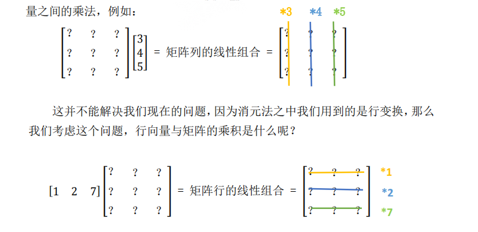
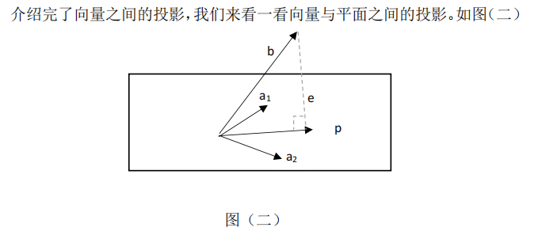

# 线性代数MIT笔记

[TOC]

### 1、方程组的几何解释

##### 线性方程组可以看作行图像/列图像

e.g.
$$
\begin{equation}
\left\{
	\begin{array}{lr}
		2x-y=0 & \\
		-x+2y=3 &
	\end{array}
\right.
\end{equation}
$$
​	行图像：

​    列图像：

##### 矩阵乘法的两种理解方式

​    p.s. 矩阵间乘法的结果最初是定义出来的
$$
C_{ij}=\sum{A_{ik}*B_{kj}} (k=1,2,...)
$$
  但结果可以看作经过行/列向量组合得到的

列向量的组合(推荐): 对A的列向量进行组合

行向量的组合:

### 2、矩阵消元

#### 极速矩阵计算:!!!! 整行/整列进行矩阵计算

**在左乘X：行生成行，对行进行分配**

**在右乘X：列生成列，对列进行分配**

（上述性质通过直观感知即可明白，类似提公因式）

以行乘为例，针对结果的第一行的每一个，都是用1*（第一行的每一个），

第一行的每一个，都是用2*（第二行的每一个），

其余类似

#### 例题：

$$
A=\left(\begin{matrix}
 4 & -1 & 2 & 1 \\
 1 & 1 & 0 & 3 \\
 0 & 3 & 1 & 4 \\
\end{matrix}\right)
, & 
B=\left(\begin{matrix}
 1 & 2 \\
 0 & 1 \\
 3 & 0 \\
 -1 & 2 \\
\end{matrix}\right)\\
求AB=?
$$

解：使用行法/列法，此时可以口算（用行，脑中列B的算后竖式）
$$
AB=\left(\begin{matrix}
 9 & 9 \\
 -2 & 9 \\
 -1 & 11 \\
\end{matrix}\right)
$$

### 3、乘法和逆矩阵

#### 矩阵乘法方法总结

1、定义：A 的行向量乘上 B 的列向量
$$
C_{ij}=\sum{A_{ik}*B_{kj}} (k=1,2,...)
$$
2、行速算

3、列速算（见上）

4、**列乘以行  **: A 的列向量乘上 B 的行向量得到各个矩阵，再将矩阵相加

证明:

例题：

5、**分块乘法 ** : 宏观矩阵乘法

证明：[矩阵分块相乘](https://zhuanlan.zhihu.com/p/133330692)

**对3.的补充：**

- **B为单列**

在变成3.时，加入行，列的划分（此时列数为1）：更详细的证明为将其分别写作
$$
A=\left(\begin{matrix}
 A11 &  A12 \\
 A21 &  A22 \\
\end{matrix}\right)
, & 
B=\left(\begin{matrix}
 B11 &  B12 \\
 B21 &  B22 \\
\end{matrix}\right)\\
C=\left(\begin{matrix}
 C11 &  C12 \\
 C21 &  C22 \\
\end{matrix}\right)\\
$$

结合图例理解，此时B11,B12等都为单列，根据列对列的分配，即B11，B21对A11,A12的列分配得到新的列C11

即C11=A11 B11 + A12 B22，

同样地，下半部分也是这样：C21=A21 B11+ A22 B21(只不过原来是整列直接分配，现在分成两个部分分开分配，其实是一个东西)

所以B分为单列的得证。

- **进一步B为多列**

​    即把B的（1，3）和边上的（* ，*）分成一块，可以简单地知道，同样是逐列分配，（1，3）那列分配后得到第一列，（ * ，*）那列分配后得到第二列，所以还是可以写成C11=A11 B11 + A12 B22等的形式。

​    所以B分为多列的得证。

- **再进一步分成多列多行块，不止两块**

​    由于分成两块成立，对其中的块继续分也成立，所以多块成立。

**至此，分块乘法得证!**

#### 逆矩阵

- 定义：

- 判定无逆矩阵

**若存在非零向量 x，使得 Ax = 0，那么 A 就不可能有逆矩阵**(否则若有，两边同左乘A-1=>x=0矛盾)

- 逆矩阵求解：**高斯-若尔当方法**

​	证明：行变换的整个矩阵可以记作E，即整个过程左乘了一个E，即E(A I )=(I ?)

​            那么利用分块矩阵乘法，EA=I => E=A-1 =>EI = A -1 ,

​            即上述式子右边的值为A-1,得证。

- 性质：
  $$
  (AB)^{-1}=B^{-1}A^{-1}
  $$
  直接相乘即可证明。

### 4、矩阵A的LU分解

#### 转置

定义：a_ij=a_ji

性质：
$$
(AB)^{T}=B^{T}A^{T}
$$

$$
\begin{align*}
&证明:\\
&设结果为C_{ij},左边式子转置前对应C'{ji}=\sum{a_{jk}*b_{ki}} \\
&右边式子同样求对应位置C_{ij}的式子为\sum{b'{ik}*a'_{kj}}=\sum{b_{ki}*a_{jk}},\\
&所以左右两边相等，得证。
\end{align*}
$$

#### 矩阵A的LU分解

秒解逆矩阵方法：

​	例如(E32)-1, 只需要5*row2+row3即可，所以根据行分配法，

​    该逆矩阵（行分配矩阵）第三行为0 * row1 + 5*row2 + 1 * row3 =>(0,5,1)

### 5、转置-转换-向量空间 R

#### 置换矩阵：

​	所谓的置换矩阵 P，就是用来完成行交换的矩阵，更具体来讲，是行重新排列

了的单位矩阵。例如 I 就是一个置换矩阵，只不过 I 对矩阵没影响。

性质：
$$
PP^T=I，即P^{-1}=P^T
$$
证明：

#### 对称阵：

A^T=A

#### 向量空间：

​	def : 该空间**对线性运算（相加，数乘）封闭**

#### 子空间: 

取向量空间的一部分，还能构成向量空间的部分我们称之为子空间

### 6、列空间和零空间

#### 列空间：列向量线性组合构成的空间

重要理解：Ax=b是否有解 <=> b是否在A的列空间中（列向量线性组合中）

#### 零空间：Ax=0的解x构成的空间

零空间始终为子空间（因为对数乘和加法封闭，始终有A(a1x+a2x')=0）

### 7、求解 Ax = 0，主变量，特解

#### 秩的定义：

**def  (同济线代第6版定义) :**

​	设在矩阵A中有一个**不等于0**的r阶子式D,且所有r+1阶子式[^1]（如果存在）全等于0，那么D称为矩阵A的最高阶非零子式，**数r称为矩阵的秩**，记作R(A),并规定零矩阵的秩为0.

​	理解：简单来看，子式（行列式）[^2]是否为0等价于是否有行线性相关（即最后某行被消去为0）=>所以，定义可以转换为

=>矩阵A转化为的 行阶梯矩阵 有r行都非0，任意r+1行一定存在一行为0

（**行阶梯矩阵** 表示 矩阵中 线性相关的行 (若有)已经被去掉为0了）

=>

**等价定义(更常用)：**

​		矩阵A转化为的 **行阶梯矩阵的非零行行数 r **即为**A的秩**。

[^1]: 子式的定义：在m*n矩阵A中，**任取**k行与k列(k<=m,k<=n),位于这些行列交叉处的k^2个元素，不改变它们在A中的所处位置次序而得到的k阶行列式，称为矩阵A的k阶子式。
[^2]: 行列式的计算：按照任意一行（列）进行展开，乘以代数余子式Mij进行求和。

这样，A的秩也可以理解为**主元的个数**（非零行)

def : 非主元所在列——**自由列**

=>性质1：列数=n-r

=>性质2：求解Ax=b时自由列可以任意取值（一定能得到唯一解）
$$
\begin{align*}
&证明:\\
&\quad 首先，r个主元<=>r个有效方程 ; n个未知数，所以自由度为n-r。\\
&e.g \\
&A=\left(\begin{matrix}
 1 & 2 & 0 & -1 \\
 0 & 0 & 1 & 2 \\
\end{matrix}\right)
, 
X=\left(\begin{matrix}
 x_1 \\
 x_2\\
 x_3\\
 x_4\\
\end{matrix}\right)
,
Ax=b=\left(\begin{matrix}
 b_1 \\
 b_2\\
\end{matrix}\right)
\\&\quad 因为所有主元列都可以把其他行该列消为0，所以所有非主元列就可以任意取值（此时为x_2,x_4),
\\&结果变为一行一个变量对应一个数的情况，所以一定有唯一解。
\\&\quad 这也验证了自由度为n-r(因为非主元列的列数刚好为n-r)
\end{align*}
$$
​	同时可以得到，A行变换后的矩阵形式类似为
$$
\left(\begin{matrix}
 I &  F \\
 0 &  0 \\
\end{matrix}\right)
$$
但I , F（Free Cols）的列可能会存在交叉，如上例,

得到的X形式上为（同样可能行有交叉)
$$
X=c\left(\begin{matrix}
 -F \\
 I \\
\end{matrix}\right)
（利用分块矩阵乘法+列分配即可得到）
$$

#### 求解Ax=0

对自由变量（列）赋值得到特殊解，线性组合即得到通解

### 8、Ax=b 的可解性和解的结构

#### **可解性**：

b是否在A的列向量线性组合的列空间中

#### **解结构**：

**通解 = 矩阵零空间通解 + 矩阵特解**

证明：

补充（由于解出了Ax=0的通解，所以v-x0一定在其中，所以相加后一定能得到Ax=b的通解。）

#### 秩与解的关系：

m*n矩阵A

- **列满秩（r=n<m)**

  无自由元 => 若方程有解，则解唯一，A消元后形式为
  $$
  A \stackrel{r}{\sim} \left(\begin{matrix}
   I\\
   0\\
  \end{matrix}\right)
  $$
  p.s : n 不可能大于m 否则列一定线性相关，不可能满秩

  

- **行满秩（r=m<n)**

​		自由元个数n-r，一定有无穷多解，A消元后形式为
$$
A \stackrel{r}{\sim} \left(\begin{matrix}
 I & F\\
\end{matrix}\right)
$$

- **满秩（r=m=n)**

  一定有唯一解

$$
A \stackrel{r}{\sim} I
$$

- **不满秩（r<m , r<n)**

  两种解可能：

  - 不满足可解条件（零行导致的可解条件）
  - 解无穷多个（特解 + 零空间所有向量）

$$
A \stackrel{r}{\sim} \left(\begin{matrix}
 I & F\\
 0 & 0\\
\end{matrix}\right)
$$

### 9、线性相关性，基，维数

#### 向量组的线性无关与线性相关:

#### 基:

- 定义：

- 性质 :

$$
\begin{align*} 
\\&𝑅^𝑛中的 n 个向量构成基，
\\&则以这 n 个向量构成的 n*n 矩阵必须可逆。
\end{align*}
$$

​		这个性质很好理解，矩阵可逆就意味着任意两行，两列都线性无关，所以可以构成一组生成空间的基。 

#### 维数：

$$
𝑅^𝑛空间的\textbf{基中向量个数}为 n 个。这个n我们称之为\textbf{维数}。
$$

#### 联系：

- **矩阵** A 的**秩** = 矩阵 A 主列的个数 = A **列空间的维数** = **r**

- **零空间维数 = n-r** （所谓零空间维数，即是零空间基的个数，也是 Ax = 0 的特解的个数，还可以理解为：Ax = 0 的解中自由变量的个数。）

### 10、四个基本子空间

#### 定义：

#### 维数与基：

**（1） 列空间：** 

​	设矩阵 A 的秩为 r，则 A 有 r 个主列，这 r 个主列就是列空间 C(A)一组基，一组基里有 r 个向量，所以**列空间维数为：r**。

​	**基求法：**行阶梯矩阵，主元列，赋值自由变量，得到基向量。

**（2） 零空间：** 

​	矩阵 A 秩为 r 时，自由列为 n-r 列。这 n-r 列决定了 x中的 n-r 个自由变元，赋值后就构成了零空间的 n-r 个基向量，故**零空间维数**

**为：n-r**。

​	**基求法:**  对自由变量（列）赋值得到特殊解，即为基向量。

**（3） 行空间：** 

​	A 的行空间可以化为𝐴^𝑇的列空间。但我们这里使用的方法是直接对A 的行向量进行变换（其实一样），最后**行空间的维数也是秩数** 

**r。** (由矩阵秩r的定义 = 行阶梯矩阵非零行行数(主元列的个数) => 线性无关行数 => 行空间维数)

​	**基求法:** 行阶梯矩阵，非零行即为基向量。

p.s. **行变换不改变行空间，但是改变列空间**

**（4） 左零空间：** 
$$
\begin{align*} 
\\& \quad 定义为:A^𝑇y = 0,y构成的空间。
\\ & \quad 我们不处理𝐴^𝑇，所以将方程两边同时转置，得到：𝑦^𝑇A = 0。我们看到，对于 A 矩阵本身来说，𝑦^𝑇左乘矩阵 A 得到零向量，所以我们称之为\textbf{左零空间}。
\\&\quad 但，还是理解为𝐴^𝑇的零空间更直接一点。
\end{align*}
$$
​	𝐴^𝑇是一个 n*m 的矩阵，m 与 n 位置颠倒，所以**𝐴^𝑇零空间（左零空间）维数为m-r**。

重要理解：

- 零空间内的向量反映的是 **A 列向量线性组合**，最终得到零向量。(Ax=0)

- 而左零空间反映的就是 **A 行向量的线性组合**，最终得到零向量。（yTA=0)

​	**基求法:** 利用 **高斯-若尔当更一般的方法** 求解基（实际上就是行变换 使向量变为0的解）。

​		**目标：yT A=0**（行组合得到零），求行组合y^T实际上是在求 ? A=0 ,那么可以参考高斯-若尔当方法进行求解（增加一个单位阵，来使用右侧的E记录整体变化的操作）。
$$
\left(\begin{matrix}
 A & I\\
\end{matrix}\right) 
\stackrel{r}{\sim} 
\left(\begin{matrix}
 R & E\\
\end{matrix}\right)
\\（ 即
E\left(\begin{matrix}
 A & I\\
\end{matrix}\right)=(R & E) ）
$$
​		利用 EA = R(行最简矩阵)求出E，寻找 R 中的零行，对应找到 E 中的线性组合方式，就得到了左零空间的基。(零行个数=m-r=基个数（自由列个数)

p.s : 求逆时使用的方法是该法的特例，R=I,E=A^-1，此时A、R都不一定是个方阵，更不要说可逆。

### 11、矩阵空间、秩 1 矩阵

#### 矩阵空间 

##### 引入：

​	线性空间的元素并不一定是实数组成的向量，我们可以将所有 3*3 的矩阵当成一个所谓“向量空间”中的向量，因为它也满足[线性空间的要求](https://zhuanlan.zhihu.com/p/597137349)。

​	这里我们可以将所有的 3*3 矩阵看做了一个线性空间，那么它的子空间有：上三角矩阵，对称矩阵，对角矩阵，

e.g. 3*3对角矩阵的一组基：（线性组合构成整个子空间）
$$
\left(\begin{matrix}
 1 & 0 & 0 \\
 0 & 0 & 0 \\
 0 & 0 & 0 \\
\end{matrix}\right)
\left(\begin{matrix}
 1 & 0 & 0 \\
 0 & 3 & 0 \\
 0 & 0 & 0 \\
\end{matrix}\right)
\left(\begin{matrix}
 0 & 0 & 0 \\
 0 & 0 & 0 \\
 0 & 0 & 7 \\
\end{matrix}\right)
$$

##### 基与维数：

​	例如，所有 3*3 矩阵构成的集合 M 可以被称为空间。

一些性质：

##### 一个小例子：

#### 其他线性空间

##### 微分方程

​	线性空间内元素不一定是向量，矩阵，还可以是方程的解。

#### 秩一空间

定义：秩为 1 的矩阵。

**优点：**

- 易于分解：

​	

- 可以搭建高维矩阵 : 比如秩为 4 的矩阵，通过四个秩一矩阵就能搭建出来。（参考矩阵的秩一分解）

### 12、图与网络

#### 图与关联矩阵

关联矩阵：每一列代表一个节点，每一行代表的就是一条边的走势 A( Edge*Node )

    
    

回路<=>线性相关 : 例如edge1,edge2,edge3构成回路，前三行线性相关。

基尔霍夫方程可以写出线性代数的形式。

### 13、复习一

具体内容见`relevant_pdf/复习1.pdf`

### 14、正交向量与子空间

**向量正交（直角）的定义1：**
$$
 \left\|x\right\|^2+\left\|y\right\|^2=\left\|x+y\right\|^2
$$
进一步展开
$$
\begin{align*}
&x^Tx+y^Ty=(x+y)^T(x+y)\\
=>&x^Tx+y^Ty=x^Tx+x^Ty+y^Tx+y^Ty\\
=>&x^Ty=0(\because x^Ty=y^Tx)
\end{align*}
$$
即**向量正交的定义2：**
$$
x^Ty=0
$$

**子空间正交的定义**：
$$
子空间S,T正交 <=> S中 \forall 向量 与T中\forall向量都正交
$$

四个基本空间的关系（行空间正交于零空间，列空间正交于左零空间，且维数互补）

**零空间与行空间的正交关系：**

证明：

​	利用子空间正交的定义，

​	已知对于一个固定的矩阵A，零空间为Ax=0的x的线性组合，行空间为A的行的线性组合

​	那么此时Ax=0的x就可以表示x的线性组合（由于Ax1=0,Ax2=0,A(kx1+jx2)=0）
$$
A=\left(\begin{matrix}
 .. & .. & .. &  \\
 .. & .. & .. &  \\
 .. & .. & .. &  \\
\end{matrix}\right),
x=\left(\begin{matrix}
 x_1\\
 x_2\\
 ..\\
 x_n\\
\end{matrix}\right)，Ax=0
$$
​	而A的任意一行乘以x都为0，所以A的行向量的线性组合乘以x也为0，所以两个子空间正交（通过两个空间任意向量正交证明）

**同理，左零空间与列空间正交（A^Ty=0）**

### 15、子空间投影

#### 二维平面上的投影

​	完整推导：
$$
\begin{align*}
注意，此时x为标量，a^Ta也为标量!\\
&a^T(b-xa)=0\\
=>&a^Tb=xa^Ta\\
=>&x=\frac{a^Tb}{a^Ta}\\
代回p=xa,得\\
&p=a\frac{a^Tb}{a^Ta}
\end{align*}
$$

##### 二维投影矩阵

p = **P**b（**P是投影矩阵**，作用于 b 向量上）

由上述式子可以得到，
$$
\begin{align*}
&\textbf{P}=\frac{aa^T}{a^Ta}
\end{align*}
$$
**二维投影矩阵性质**：

- P^T=P(利用公式推导，只有上半部分是矩阵，需要转置)

- P^2=P(直接做乘法证明，其得到的结果具有明显的几何意义:在某个方向上重复投影=单次投影)

  

#### 高维（一般）平面上的投影

##### 对于任意矩阵A，有r(A^T A)=r(A)

**证明：**

- **首先，证明A^TA的零空间与A的零空间相同。**

  正向：

  ​	x在ATA的零空间里，所以ATAx＝0。

  ​	我们在等式两边同左乘xT，可以得到（Ax）TAx＝0

  ​	也就是‖Ax‖²＝0，所以Ax＝0（因为x^Tx=0,每个数的平方和，所以每个都是0），所以x也在A的零空间里。 

  反向：

  ​	让A是任意的一个矩阵，x在它的零空间里，即，Ax＝0。

  ​	在等式两边的左侧同乘AT，可以得到ATAx＝0，所以，x在矩阵ATA的零空间里。

  得证。

- **接着，证明r(A^T A)=r(A)**

  ​	因为A^TA与A有相同的零空间，即两者线性组合得到零的方式是相同的，即列的相关关系是相同的；既然列间相关关系是相同的，所以线性相关的个数也是相同的，即秩相同。

  ​	得证。

**A^T A的性质**：方阵，对称，（不一定可逆,仅当A的各列线性无关时，才满秩，即可逆）

##### 高维（一般）投影矩阵

显然，更高维只是ai的个数变多，整体式子不变，即该式具有一般性。

即
$$
\begin{align*}
&\textbf{P}=A(A^TA)^{-1}A^T
\end{align*}
$$

**高维（一般）投影矩阵性质**：P^T=P ； P^2=P（对式子进行转置或乘法即可得到结果）

​	当A可逆时/A列向量无关时，A^TA可逆（满秩），P可以化简为 I(单位阵)——同时，可以用另一个角度理解：当A可逆，其列空间为n维空间，所以投影矩阵不需要，即任意向量都在其中，即用单位阵 I 即可。

#### 为什么需要投影?

​	Ax=b可能无解，因为掺杂了一些坏数据，此时要求出Ax=b的近似最优解

=>解最近的（微调b,将b投影到最近的A的列空间中）

=>Ax=b转化为A𝑥̂=p

具体求法见下一部分。

重要理解：**两边同乘一个矩阵可能会改变等式两边关系**

- **同乘可逆矩阵等式关系不变**（因为可以同乘其逆矩阵返回/没有损失限制信息）

- **同乘不可逆矩阵等式关系会变**（乘以一个奇异矩阵可能会使原本不相等的关系变得相等。这是因为奇异矩阵可能会使某些行或列变为零，从而丢失原来的限制信息。）

  ​	例：

  

### 16、最小二乘法

#### 引入：

无解方程的最优解=>将b投影到最近的A的列空间中

    
    

#### 求解方法:

**推导：**

将b投影至最近的A列空间（列满秩），
$$
\begin{align*}
&\textbf{P}=A(A^TA)^{-1}A^T
\end{align*}
$$

**最终公式：**

（两边同乘A^T(由于A不一定可逆，所以解可能与原来的不同，记作𝑥̂) ,主要是原来Ax!=b，所以同乘后也不等。）
$$
𝐴^𝑇A𝑥̂ = 𝐴^𝑇b：
$$

### 17、正交矩阵和 Gram-Schmidt 正交化
